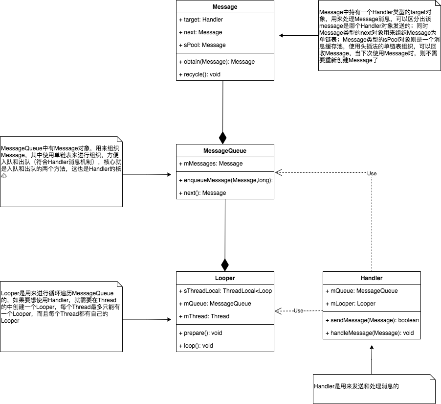

# Handler详解

> 只要提到`handler`，大家肯定都会想到其他的几个类`Looper`、`MessageQueue`、`Message`，我也不例外，让我们先来看看这个几个类的官方介绍。不过在开始之前，我们先抛出一些问题，然后在探索源码的过程中，逐个击破。

### 相关问题：

1. 简述Handler原理
2. Hanlder的主要作用？
3. 在我们使用handler的post和sendMessage的区别？
4. 一个线程有几个Handler？一个线程有几个Looper？如何保证？
5. 主线程为什么不用初始化Looper？
6. Handler如何保证MessageQueue并发访问安全？
7. 通过post发送的消息是在什么时候执行的呢？
8. handler的handlerMessage是在哪个线程被调用的？
9. Handler线程是如何切换的？
10. looper的死循环为什么没有导致UI线程阻塞ANR？
11. handler中的postdelay是如何实现的？
12. IdleHandler的原理？
13. Handler内存泄漏的原因是什么？如何解决?
14. 能不能让一个Message加急被处理？/ 什么是Handler同步屏障？

### 概述

关于官方文档我就不截图了，大家可以自行点击前往官网进行阅读，下面是传送门：
[Handler](https://developer.android.com/reference/android/os/Handler#nested-classes)
[Looper](https://developer.android.com/reference/android/os/Looper)
[MessageQueue](https://developer.android.com/reference/android/os/MessageQueue)
[Message](https://developer.android.com/reference/android/os/Message#setData(android.os.Bundle))

下面我总结一下：

1. Handler可以发送和处理与消息队列关联的`Message`或者`Runnable`，每个`Handler`都只与一个`Thread`、这个`Thread`中的`Looper`和这个`Looper`中的`MessageQueue`相关联。**一个Thread**可以对应**多个Handler**，但是**一个Handler**只能对应**一个Thread**，**一个Looper**和**一个MessageQueue**。
2. Handler的两个主要用途： 1> 处理在将来某个时间执行的`Message`或者`Runnable`； 2> 将一个要在其他线程执行的功能包装成一个`Message`加入这个`Thread`对应的队列中，执行完成后再切回当前线程。也就是我们经常使用的，子线程做耗时操作，然后切回主线程更新UI。
3. Handler有两类API用来安排消息：1> `postXxx()`类型的，这种可以将`Runnable`插入到消息队列等待被执行；2> `sendMessageXxx`,这种可以将`Message`插入到消息队列，当遍历到该消息后，会执行到`Handler`的`handleMessage(Message)`方法。如果只是执行一段代码逻辑的话，直接使用`postXxx()`就可以；如果需要传递一些数据到`Handler`所在的线程执行，并且对要执行的`Message`进行组织的话，就使用`sendMessageXxx()`的方法。同时上述两种API可以允许你控制插入的消息立即执行、延时执行或者到某个时间点再执行。
4. 如果你不想实现一个`Handler`的子类，那么你可以使用带`Handler.Callback`参数的构造方法去初始化`Handler`。
5. `Looper`的作用是用来进行消息循环的，在一个普通的线程中，并没有关联`Looper`，我们需要使用`Looper`类的`prepare()`和`loop()`方法来启动消息循环，典型的使用如下：
		
		class LooperThread extends Thread {
		      public Handler mHandler;
		      public void run() {
		          Looper.prepare();
		          mHandler = new Handler() {
		              public void handleMessage(Message msg) {
		                  // process incoming messages here
		              }
		          };
		          Looper.loop();
		      }
	     }
	     
6. `MessageQueue`使用一个单链表组织一系列被`Handler`分发的`Message`对象，`Message`对象是通过与`Looper`关联的`Hanlder`添加到`MessageQueue`的，通过`Looper#myQueue()`可以获取到所关联的`MessageQueue`的对象
7. `Message`可以携带要发送到`Handler`的信息，`Message`类有多个int的成员变量和其他类型的成员变量，int类型成员变量arg1和arg2，可以携带轻量级的数据，`Object`类型的成员变量obj可以携带任意类型的数据；初始化`Message`推荐使用`Message.obtain()`或者`Handler#obtainMessage()`，这样可以复用回收池里的`Message`对象

以上只是对官方文档对他们的描述的总结，下面简单介绍几种典型的用法

### API简介
API分为以下几类：

* 初始化方法：

| 方法             | 简介 |
| ------------- | ------------- |
| Handler()  |直接使用创建Handler线程的Looper做关联  |
| Handler(Handler.Callback callback) | 直接使用创建Handler线程的Looper做关联，<br>同时传入Handler.Callback，当你创建Handler，并且不想搞一个<br>handler的子类的话，可以用这个方法  |
 上述两个方法，由于隐式的关联`Looper`可能导致bug，官方标记为deprecated，不建议使用。下面两个是显式传入`Looper`的两个与之对应的方法，推荐使用：

|  方法  | 简介 |
| ------------- | ------------- |
| Handler(Looper looper) | 使用传入的Looper做关联 |
| Handler(Looper looper, Handler.Callback callback) | 使用传入的Looper做关联，同时传入Handler.Callback，<br>当你创建Handler，并且不想搞一个handler的子类的话，<br>可以用这个方法  |
	
* 初始化`Message`的一类方法

|  方法   |
| ---------- |
|obtainMessage(int what, int arg1, int arg2, Object obj)|
|obtainMessage(int what, int arg1, int arg2)|
|obtainMessage(int what)|
|obtainMessage()|
|上述四个重写的方法，当传入对应参数时，就会创建一个带了这些参数的`Message`，<br>创建`Message`时，会复用消息池中的消息，推荐使用|
	
* 添加消息的一类方法

|  方法  | 简介 |
| ------------- | ------------- |
|post(Runnable r) |直接发送一个Runnable|
|postAtFrontOfQueue(Runnable r)|将Runnable插入到队首|
|postAtTime(Runnable r, long uptimeMillis)|插入一个在给定的uptimeMillis执行的Runnable|
|postAtTime(Runnable r, Object token, long uptimeMillis)|插入一个在给定的uptimeMillis执行的Runnable，<br>token可以用来移除Runnable|
|postDelayed(Runnable r, long delayMillis)|插入一个延时delayMillis执行的Runnable|
|postDelayed(Runnable r, Object token, long delayMillis)|插入一个延时delayMillis执行的Runnable，<br>token可以用来移除Runnable|


|  方法   |
| -------------------------- |
|sendEmptyMessage(int what)|
|sendEmptyMessageAtTime(int what, long uptimeMillis)|
|sendEmptyMessageDelayed(int what, long delayMillis)|
以上三个是发送不带`Message`的一类方法，what是用来区分消息的

|  方法   |
| -------------------------- |
|sendMessage(Message msg)|
|sendMessageAtFrontOfQueue(Message msg)|
|sendMessageAtTime(Message msg, long uptimeMillis)|
|sendMessageDelayed(Message msg, long delayMillis)|
以上四个是发送带`Message`的一类方法，各个方法的功能与`postXxx()`的方法一样，`postXxx()`的方法源码其实最终还是使用的`sendMessageXxx()`的方法

其他API就不做过多赘述了

### 使用
	
* 子线程耗时操作，在主线程更新UI，使用的是`sendMessage()`方法，子线程拿到`Person`，并送到主线程中去执行

```
public static final String TAG = HandlerActivity.class.getSimpleName();

    @Override
    protected void onCreate(@Nullable Bundle savedInstanceState) {
        super.onCreate(savedInstanceState);
        setContentView(R.layout.activity_handler);
        final UIHandler handler = new UIHandler();
        findViewById(R.id.execute).setOnClickListener(view -> {
            new Thread() {
                @Override
                public void run() {
                    Log.i(TAG, "current Thread is " + Thread.currentThread().getName());
                    SystemClock.sleep(500);
                    Person person = new Person("lily", 23, 165);
                    Message message = handler.obtainMessage(0, person);
                    handler.sendMessage(message);
                }
            }.start();
        });

    }

    static class UIHandler extends Handler {
        @Override
        public void handleMessage(Message msg) {
            super.handleMessage(msg);
            if (msg.what == 0) {
                Person person = null;
                if (msg.obj instanceof Person) {
                    person = (Person) msg.obj;
                }
                Log.i(TAG, "current thread is " + Thread.currentThread().getName() + ", msg.what : 0, " + person);
            }
        }
    }
```

* 延时执行的方法，下面模拟的是延时1s后执行对应的操作，当然是在同一个线程中。这个使用的是post传入Runnable的方法，延时1s会执行run()方法

```
Handler delayHandler = new Handler();
findViewById(R.id.execute2).setOnClickListener(view -> {
  long start = SystemClock.uptimeMillis();
  delayHandler.postDelayed(new Runnable() {
      @Override
      public void run() {
          Log.i(TAG, "test handler delay " + (SystemClock.uptimeMillis() - start));
      }
  }, 1000);
});
```

### 源码解析
> 以下源码基于Android-29分析

#### 核心类图



#### 1. 消息机制的基本原理

Handler中的消息机制，首先会通过`Handler`将一条消息发送到`MessageQueue`中，而`Looper`会不断的从`MessageQueue`中拿取消息并执行，所以，我们先看下Looper的初始化的位置。Looper的初始化分为两种，一种是主线程的Looper，一种是其他线程的Looper。
主线程的Looper由Framework自己创建，代码如下：

```
// ActivityThread.java

public static void main(String[] args) {
... ... 
	Looper.prepareMainLooper();
	...
	ActivityThread thread = new ActivityThread();
	thread.attach(false, startSeq);
	if (sMainThreadHandler == null) {
       sMainThreadHandler = thread.getHandler();
   }
	...
	Looper.loop();
	...
}

// Looper.java

public static void prepareMainLooper() {
        prepare(false);
        synchronized (Looper.class) {
            if (sMainLooper != null) {
                throw new IllegalStateException("The main Looper has already been prepared.");
            }
            sMainLooper = myLooper();
        }
}

public static void prepare() {
   prepare(true);
}

private static void prepare(boolean quitAllowed) {
   if (sThreadLocal.get() != null) {
       throw new RuntimeException("Only one Looper may be created per thread");
   }
   sThreadLocal.set(new Looper(quitAllowed));
}

```

主线程的Looper会在ActivityThread类的main方法中创建，首先调用`Looper#prepareMainLooper()`方法，而该方法中又回调用`Looper#prepare()`来new一个Looper，并将其绑定到ThreadLocal中，ThreadLocal是与线程绑定的，也就是说，new Looper的代码是在哪个线程调用的，该Looper实例就会与哪个线程绑定，同时，一个线程只能有一个Looper，否则就会抛异常`new RuntimeException("Only one Looper may be created per thread")`。
之后的`sMainThreadHandler = thread.getHandler();`就可以用来处理Activity、Service等的各个生命周期方法等，该代码详细可以具体研究Framework的源码，在此不做赘述。
最后调用`Looper.loop();`，开启消息循环，在该方法中，会开启一个死循环，从消息队列中不断的拿取消息。

子线程创建Looper代码如下（官方给出的代码示例）：

```
class LooperThread extends Thread {
      public Handler mHandler;

      public void run() {
          Looper.prepare();
          mHandler = new Handler(Looper.myLooper()) {
              public void handleMessage(Message msg) {
                  // process incoming messages here
              }
          };
          Looper.loop();
      }
  }
  ```
  
  可以看出，子线程初始化Looper的方式，与Framework中初始化主线程Looper的逻辑基本一致，这里就不多赘述了，接下来，我们重点看下`Looper.loop()`中的死循环的逻辑。
  
  ```
  // Looper.java
  
  public static void loop() {
        final Looper me = myLooper();
        if (me == null) {
            throw new RuntimeException("No Looper; Looper.prepare() wasn't called on this thread.");
        }
        final MessageQueue queue = me.mQueue;

        for (;;) {
            Message msg = queue.next(); // might block
            if (msg == null) {
                // No message indicates that the message queue is quitting.
                return;
            }
            final MessageQueue queue = me.mQueue;
            
				... 
      
            msg.target.dispatchMessage(msg);
            
            ...

            msg.recycleUnchecked();
        }
    }
  ```
  
 以上代码精简后，可以看出，`Looper.loop()`的主要逻辑就是，使用一个死循环，一直调用`MessageQueue#next()`方法，从消息循环中拿消息，如果拿到之后就调用`Message#target#dispatchMessage`方法，来分发消息，消息分发完成后，调用`Message#recycleUnchecked()`将消息回收，并放入到消息池中。这里消息池使用的是一个单链表来存储的，并且使用的是头插法，代码如下：
 
 ```
 // Message.java
 
void recycleUnchecked() {
 	// 将message中的各个字段恢复为初始值
 	... 
	// 使用头插法，将消息插入到消息池。使用同步锁sPoolSync，来避免从消息池中拿消息跟放消息时，造成线程间冲突。MAX_POOL_SIZE = 50
   synchronized (sPoolSync) {
       if (sPoolSize < MAX_POOL_SIZE) {
           next = sPool;
           sPool = this;
           sPoolSize++;
       }
   }
}
 ```
 
 接下来我们继续分析从消息队列中取消息的方法`MessageQueue#next()`，代码如下：
 
 ```
 // MessageQueue.java
 
 Message next() {
        // Return here if the message loop has already quit and been disposed.
        // This can happen if the application tries to restart a looper after quit
        // which is not supported.
        final long ptr = mPtr;
        if (ptr == 0) {
            return null;
        }

        int pendingIdleHandlerCount = -1; // -1 only during first iteration
        int nextPollTimeoutMillis = 0;
        for (;;) {

            nativePollOnce(ptr, nextPollTimeoutMillis);

            synchronized (this) {
                // Try to retrieve the next message.  Return if found.
                final long now = SystemClock.uptimeMillis();
                Message prevMsg = null;
                Message msg = mMessages;
                // 当msg.target为空时，证明这是一个消息屏障，这里要执行异步消息
                if (msg != null && msg.target == null) {
                    // Stalled by a barrier.  Find the next asynchronous message in the queue.
                    do {
                        prevMsg = msg;
                        msg = msg.next;
                    } while (msg != null && !msg.isAsynchronous());
                }
                if (msg != null) {
                		// 还没有到达消息的执行时间，则此时指定一个下次的唤醒时间
                    if (now < msg.when) {
                        // Next message is not ready.  Set a timeout to wake up when it is ready.
                        nextPollTimeoutMillis = (int) Math.min(msg.when - now, Integer.MAX_VALUE);
                    } else {
                        // Got a message.
                        mBlocked = false;
                        // 执行到这里，则将该消息从单链表中移除
                        if (prevMsg != null) {
                            prevMsg.next = msg.next;
                        } else {
                            mMessages = msg.next;
                        }
                        // 将消息取出，并标记为使用中，并返回
                        msg.next = null;
                        if (DEBUG) Log.v(TAG, "Returning message: " + msg);
                        msg.markInUse();
                        return msg;
                    }
                } else {
                    // No more messages.
                    nextPollTimeoutMillis = -1;
                }

                // Process the quit message now that all pending messages have been handled.
                if (mQuitting) {
                    dispose();
                    return null;
                }
						// 代码执行到这里，表明消息队列中暂时没有可执行的消息，则尝试执行IdleHandler
                // If first time idle, then get the number of idlers to run.
                // Idle handles only run if the queue is empty or if the first message
                // in the queue (possibly a barrier) is due to be handled in the future.
                if (pendingIdleHandlerCount < 0
                        && (mMessages == null || now < mMessages.when)) {
                    pendingIdleHandlerCount = mIdleHandlers.size();
                }
                if (pendingIdleHandlerCount <= 0) {
                    // No idle handlers to run.  Loop and wait some more.
                    mBlocked = true;
                    continue;
                }

                if (mPendingIdleHandlers == null) {
                    mPendingIdleHandlers = new IdleHandler[Math.max(pendingIdleHandlerCount, 4)];
                }
                mPendingIdleHandlers = mIdleHandlers.toArray(mPendingIdleHandlers);
            }

            // Run the idle handlers.
            // We only ever reach this code block during the first iteration.
            for (int i = 0; i < pendingIdleHandlerCount; i++) {
                final IdleHandler idler = mPendingIdleHandlers[i];
                mPendingIdleHandlers[i] = null; // release the reference to the handler

                boolean keep = false;
                try {
                    keep = idler.queueIdle();
                } catch (Throwable t) {
                    Log.wtf(TAG, "IdleHandler threw exception", t);
                }

                if (!keep) {
                    synchronized (this) {
                        mIdleHandlers.remove(idler);
                    }
                }
            }

            // Reset the idle handler count to 0 so we do not run them again.
            pendingIdleHandlerCount = 0;

            // While calling an idle handler, a new message could have been delivered
            // so go back and look again for a pending message without waiting.
            // 如果有idle handler执行了，则下次继续从消息队列中取消息，而不是进行阻塞
            nextPollTimeoutMillis = 0;
        }
    }
 ```
 
 上述代码中，已经进行了一些注释，大致的流程就是：首先，会将当前`mMessages`指向的消息，赋值给局部变量`msg`，即代码`Message msg = mMessages;`，拿到链表中的第一个消息；之后，判断该消息是否为消息屏障（判断是否为消息屏障，是看该消息的target是否为空，即该消息是否有handler，如果target为空，则是消息屏障），如果是消息屏障，则要优先响应异步消息。第二步，判断取到的消息是否为空，如果不为空，则判断是否到了执行时间，如果没到，则设置一个下次唤醒的时间，如果到了则去除该消息，并返回。（判断是否到了执行时间，通过`now = SystemClock.uptimeMillis(); now < msg.when`来判断）。如果消息为空，则执行`nextPollTimeoutMillis = -1`，这样下次循环线程就会阻塞。最后，即使消息队列中没有消息了，也要再判断下IdleHandler是否要执行，如果有，则执行完并将`nextPollTimeoutMillis = 0`重新恢复为0，防止线程阻塞，因为这时消息队列中可能有了新消息，如果没有，则continue，阻塞线程。
至此，消息从Looper开启消息循环，到循环从MessageQueue中取消息，到如何拿到消息并返回，就分析结束了。调用过程为`Looper#loop()->for(;;)->MessageQueue#next()->for(;;)->return msg->Message#target#dispatchMessage(msg)`

下面继续分析另一半，向消息队列中添加消息的方法，以`Hanlder#sendMessage(Message msg)`为切入点，代码如下:

```
// Handler.java

public final boolean sendMessage(Message msg){
   return sendMessageDelayed(msg, 0);
}

public final boolean sendMessageDelayed(Message msg, long delayMillis){
   if (delayMillis < 0) {
       delayMillis = 0;
   }
   return sendMessageAtTime(msg, SystemClock.uptimeMillis() + delayMillis);
}

public boolean sendMessageAtTime(Message msg, long uptimeMillis) {
   MessageQueue queue = mQueue;
   if (queue == null) {
       RuntimeException e = new RuntimeException(
               this + " sendMessageAtTime() called with no mQueue");
       Log.w("Looper", e.getMessage(), e);
       return false;
   }
   return enqueueMessage(queue, msg, uptimeMillis);
}

private boolean enqueueMessage(MessageQueue queue, Message msg, long uptimeMillis) {
   msg.target = this;
   if (mAsynchronous) {
       msg.setAsynchronous(true);
   }
   return queue.enqueueMessage(msg, uptimeMillis);
}
```

可以看到，代码中`sendMessage(Message msg)`会调用到`sendMessageDelayed(Message msg, long delayMillis)`，这里因为不是延迟消息，所以delayMillis为0，之后会继续调用`sendMessageAtTime(Message msg, long uptimeMillis)`，这里uptimeMillis为SystemClock.uptimeMillis() + delayMillis，也就是具体的消息执行的时间点，最终会调用`enqueueMessage(MessageQueue queue, Message msg, long uptimeMillis)`方法，来将消息插入到消息队列，这里有两个点需要关注下，第一个是在这里会调用`msg.target = this`将Message的target赋值为当前的handler，第二是如果是异步消息，则会调用message的msg.setAsynchronous，将其标记为异步消息。由于这个方法中，调用了MessageQueue的enqueueMessage方法，我们继续跟进到MessageQueue的代码中：

```
// MessageQueue.java

boolean enqueueMessage(Message msg, long when) {
   if (msg.target == null) {
       throw new IllegalArgumentException("Message must have a target.");
   }
   if (msg.isInUse()) {
       throw new IllegalStateException(msg + " This message is already in use.");
   }

   synchronized (this) {
       if (mQuitting) {
           IllegalStateException e = new IllegalStateException(
                   msg.target + " sending message to a Handler on a dead thread");
           Log.w(TAG, e.getMessage(), e);
           msg.recycle();
           return false;
       }

       msg.markInUse();
       msg.when = when;
       Message p = mMessages;
       boolean needWake;
       if (p == null || when == 0 || when < p.when) {
           // New head, wake up the event queue if blocked.
           msg.next = p;
           mMessages = msg;
           needWake = mBlocked;
       } else {
           // Inserted within the middle of the queue.  Usually we don't have to wake
           // up the event queue unless there is a barrier at the head of the queue
           // and the message is the earliest asynchronous message in the queue.
           needWake = mBlocked && p.target == null && msg.isAsynchronous();
           Message prev;
           for (;;) {
               prev = p;
               p = p.next;
               if (p == null || when < p.when) {
                   break;
               }
               if (needWake && p.isAsynchronous()) {
                   needWake = false;
               }
           }
           msg.next = p; // invariant: p == prev.next
           prev.next = msg;
       }

       // We can assume mPtr != 0 because mQuitting is false.
       if (needWake) {
           nativeWake(mPtr);
       }
   }
   return true;
}
```
在这个方法中，如果消息队列为空，或者when==0，或者执行时间比头节点时间早，则直接将消息放入到消息队列的头部，并将其赋值给头节点；其他情况，则循环遍历消息队列，因为消息队列是按照Message#when的时间升序排列的，所以找到第一个小于的节点，并将其插入。如果需要唤醒的话，则调用`nativeWake(mPtr)`，将队列唤醒即可。在这里需要注意的是，**synchronized (this)**在enqueueMessage()和next()方法中均有调用，可以保证存消息跟取消息的同步操作。
至此，Handler存入消息的方法，也就分析完毕了。


### 问题解答

1. 简述Handler原理

	> 首先在一个线程A中初始化一个`Handler`，然后在其他线程B中，通过`Handler`的`sendMessageXXX`或者`postXXX`的方法，向线程B的`MessageQueue`中发送一个消息，因为`MessageQueue`中的消息是按照时间的升序排列的，所以在`MessageQueue`中，会通过传入的`uptimeMillis`的时间，通过头插法，将收到的消息放到合适的位置，该`MessageQueue`中用来维护消息的结构是单链表；同时另一个类`Looper`，会一直通过`loop()`方法中调用`MessageQueue`的`next()`方法，从消息队列中取消息，取到消息之后，会调用`message.target.dispatchMessage()`方法，该方法中，会先看看`message`中有没有`callback`，如果有，则优先响应`callback`的方法，如果没有，则看看`handler`中的`mCallback`是否为空，如果不为空，则响应`mCallback.handleMessage(msg)`，最后如果上述两者都为空，则响应自身的`handleMessage()`方法，这个方法一般由我们进行重写。
	
2. Hanlder的主要作用？

	> 根据官方文档，Handler的主要作用有两个：第一，是执行一些在未来某个时间要执行的操作，基于时间的操作，比如延迟操作，定时操作等，都可以使用Handler；第二，是将一个操作插入到其他线程去执行，最典型的就是在子线程中请求数据，然后在主线程中更新UI。
	 
3. 一个线程有几个Handler？一个线程有几个Looper？如何保证？
	
	> 一个线程可以有多个Handler，但是一个Handler只能有一个Looper，因为Handler的初始化，如果是没有Looper参数的版本，拿到的是当前线程绑定的Looper对象，如果是带Looper参数的版本，则只保存传入的Looper对象。同时一个Looper也只与一个线程绑定，这是由`Looper#prepare()`方法的调用决定的，在该方法中，初始化Looper完成后，会保存到ThreadLocal中，与线程绑定。
	
4. 主线程为什么不用初始化Looper？

	> 因为主线程中的Looper是由Framework在ActivityThread中创建的，同样也是调用的Looper#prepare()，然后调用ActivityThread#attach通过IPC进行相关的绑定操作，之后再调用Looper#loop()，开启主线程的消息循环。
	
5. Handler如何保证MessageQueue并发访问安全？

	> 在MessageQueue中的enqueueMessage(Message msg, long when)存入消息的方法和next()取出消息的方法中，使用synchronized (this)对单链表的操作进行了同步，从而保证了并发的访问安全

6. 在我们使用handler的post和sendMessage的区别？

	> post的方法传递的是一个Runnable对象，而我们需要实现其中的run方法，以使得当消息队列执行到该消息时，执行我们的逻辑，在post的方法内部其实还是帮我们生成了一个Message对象，并将我们的Runnable对象赋值给了Message的callback，该Message对象的obj和what等其他参数均为默认值，这种方式是没有数据传递的；而sendMessage方法则是需要我们传递一个Message，或者what等，这种方式我们可以传递数据。

7. 通过post发送的消息是在什么时候执行的呢？

	> 个人见解，如果直接调用的post(Runnable r)的方法，则等上一个消息的执行结束，则直接执行post发送的消息，如果是postDelay()的方法的话，则到对应的时间点才执行。

8. handler的handlerMessage是在哪个线程被调用的？

	> 是在初始化Handler对象时，初始化looper对象，里面的looper所属的线程中调用的。初始化handler有不传入looper的版本，和传入looper的版本。不传入looper的版本，会将当前线程的looper传入到Handler中，但是该方法已被官方标记为废弃；传入looper的版本，则传入的looper是哪个，就是哪个。

9. Handler线程是如何切换的？

	> Handler在初始化时，同时会初始化looper，这个Looper可能是传入的，也可能是在构造方法中通过Looper.myLooper()拿到的，而这个looper是会跟线程绑定的，并且绑定之后会使用Looper.loop()开启死循环，当Handler在其他线程发送消息时，会将消息发送到Looper中的MessageQueue，同时由于Looper.loop()会一直从MessageQueue中取消息，取到消息后就会在Looper所在的线程执行对应的逻辑，从而实现了线程切换。

10. looper的死循环为什么没有导致UI线程阻塞ANR？

	> 首先要明白ANR的本质是什么，其实出现ANR并不是说线程阻塞了就会出现ANR，而是在处理某个消息时，这个消息很耗时，从而导致有大量的消息阻塞，包括触摸屏幕等，从而会出现ANR。而主线程Looper的死循环就是在不断的遍历消息处理消息而已，正是由于有了这个死循环，才能保证主线程不退出，从而不断的处理Activity生命周期，手指触摸屏膜等等。同时，即使MessageQueue中没有消息了，那么在Looper取消息的过程中，会通过Linux的epoll机制睡眠当前的线程，让出cpu的使用权，因为没有需要处理的消息了，从而也不会产生ANR。

11. handler中的postDelay是如何实现的？

	> handler在调用delay相关的方法时，会传入一个我们指定的延迟的耗时，在这个方法内部，会先获取到当前的时间戳，然后使用这个时间戳再加上我们传入的延迟时间，并将这个结果存入到message的when字段中，之后，在该方法中会继续调用MessageQueue的enqueue方法，将该message出入到消息队列中。由于MessageQueue中的消息队列是按照message的when字段去排序的，从而在插入该消息时，会根据message中的when字段去确定需要插入的位置。当Looper取消息时，如果当前的时间小于取到的message的when中存入的时间的话，就会使用message中的when存的时间减去现在的时间now得到一个差值nextPollTimeoutMillis，从而使用nativePollOnce这个native方法，就可以睡眠一个nextPollTimeoutMillis时间后，执行这个消息了，从而实现了postDelay的操作。

12. IdleHandler的原理？

	> 在MessageQueue循环取消息的过程中，如果消息队列中没消息了，这个时候就会判断IdleHandler是否还有消息需要处理，如果需要处理，则执行idleHandler的queueIdle方法，执行其逻辑，从而充分利用MessageQueue的空闲时间。

13. Handler内存泄漏的原因是什么？如何解决?

	> 一般Handler的内存泄漏都是我们直接创建了非静态的匿名内部类，实现了handleMessage方法，从而导致非静态匿名内部类持有了外部的activity的引用，而导致内存泄漏的根本原因就在于Handler的生命周期与宿主Activity的生命周期不一致。比如如果Handler发送了一个延迟消息，消息还未执行，但是activity已经销毁，则会导致activity无法回收，从而出现了内存泄漏。

14. 能不能让一个Message加急被处理？/ 什么是Handler同步屏障？

	> 可以使用sendMessageAtFrontOfQueue将一个消息放入到消息队列的队头，内部实现其实是调用了MessageQueue#enqueueMessage方法，并传入的时间为0，从而达到直接将消息放到队头的操作。或者发送一个异步消息，并使用消息屏障，将同步消息拦截，从而使得异步消息先执行。
	Handler的同步屏障就是，向消息队列中，发送一个target为空的Message，当Looper拿到这个消息时，则表明该消息为消息屏障，这种情况就会往后遍历消息队列，拿到被标记为异步的Message，从而优先执行异步消息。使用场景，比如ViewRootImpl#scheduleTraversals中，就使用到了消息屏障，并且其中会使用Choreographer向消息队列中插入一条异步消息，并且在runnable中需要将消息屏障移除。

### 参考

[Android消息机制1-Handler(Java层)](http://gityuan.com/2015/12/26/handler-message-framework/)
[Android中为什么主线程不会因为Looper.loop()里的死循环卡死？](https://www.zhihu.com/question/34652589/answer/90344494)
[android - what is message queue native poll once in android?](https://stackoverflow.com/questions/38818642/android-what-is-message-queue-native-poll-once-in-android)
[Android | 面试必问的 Handler，你确定不看看？](https://www.jianshu.com/p/70d5785ee4c3)


